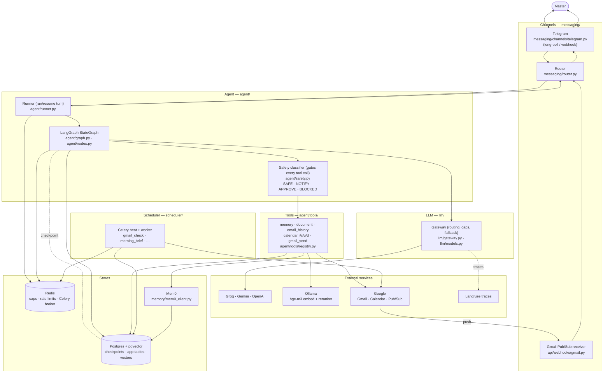
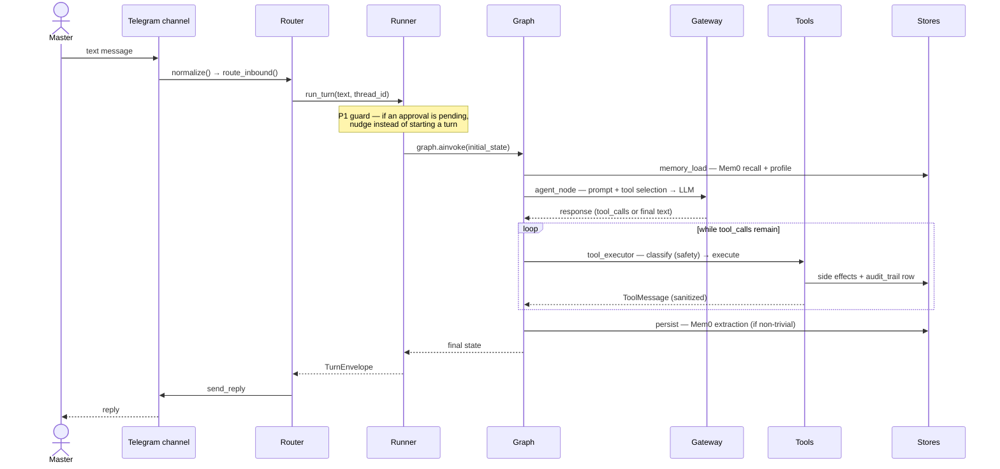
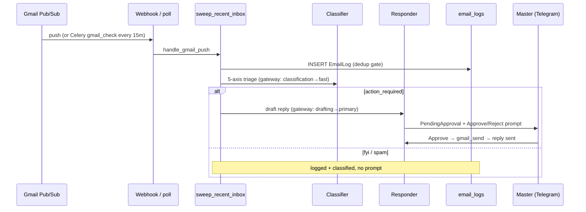
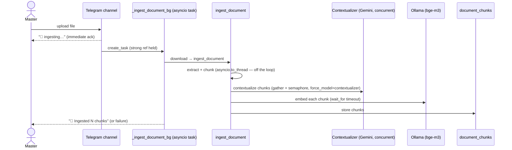

# Jarvis — Architecture

Jarvis is a **self-hosted, single-master autonomous personal assistant**: a FastAPI + Celery
backend, a LangGraph agent, Telegram as the chat surface, Gmail/Calendar as tools, with
Postgres+pgvector, Redis, Mem0, a LiteLLM gateway, and Langfuse for observability.

This file is the **hand-authored intent** — the overview, the whole-system data flow (DFD), and the
request-lifecycle sequences. The **mechanical reference** is auto-generated and never edited by hand:

| Generated reference | What |
|---|---|
| [Module map](generated/00_module_map.md) | every `app/` + `scripts/` module + its role |
| [Database ERD](generated/01_database_erd.md) | all tables/columns (no DB-level FKs — linked by `thread_id`) |
| [API routes](generated/02_api_routes.md) | every route + auth |
| [Tools & safety tiers](generated/03_tools.md) | the 8 tools, SAFE/APPROVE |
| [Celery schedule](generated/04_celery_schedule.md) | the beat jobs |
| [Agent graph](generated/05_agent_graph.md) | the LangGraph topology |
| [LLM gateway routing](generated/06_llm_gateway.md) | slots, `TASK_ROUTING`, force_model, caps |
| [External services](generated/07_external_services.md) | infra + providers + endpoints |

Design rationale, seams, and the deferred-with-trigger inventory live in **[decisions.md](decisions.md)**.

> Diagrams reference the backing file for each block (e.g. `messaging/router.py`). Paths are relative
> to `backend/app/` unless noted.

---

## System data flow (DFD)



See [06_llm_gateway.md](generated/06_llm_gateway.md) for gateway routing and
[07_external_services.md](generated/07_external_services.md) for the full dependency inventory.

---

## Request lifecycles

### 1. A Telegram chat turn



**Backing files:** Telegram `channels/telegram.py` · Router `messaging/router.py` · Runner
`agent/runner.py` · Graph `agent/graph.py` + `agent/nodes.py` · prompt `agent/prompts.py` · tool
selection `agent/tools/registry.py` · safety `agent/safety.py` · sanitize `agent/sanitizer.py` ·
memory `memory/manager.py`.

### 2. Inbound email (classify → draft → approve → send)



**Backing files:** receiver `api/webhooks/gmail.py` · pipeline `email/gmail_pubsub.py` · poll
`scheduler/tasks/gmail_check.py` · classify `email/classifier.py` · draft `email/responder.py` ·
approval dispatch `messaging/router.py` (`_resolve_gmail_approval`) · send `agent/tools/gmail_send.py`.

### 3. The approval interrupt / resume (HITL)

```mermaid
sequenceDiagram
    participant G as Graph (tool_executor)
    participant DB as pending_approvals + checkpoint
    participant M as Master
    participant RUN as Runner

    G->>DB: _find_pending_approval(interrupt_id)
    alt none yet (first pass)
        G->>DB: _create_pending_approval (+ conflict warning for calendar_create)
        G->>M: send_approval_request_to_master (Telegram buttons)
    else already exists (resume re-runs node)
        Note over G: skip duplicate create+send (P3 guard)
    end
    G->>G: interrupt() — snapshot state, pause
    M->>RUN: tap Approve/Reject → resolve_approval → route_approval_decision
    RUN->>G: resume_turn → ainvoke(Command(resume=decision))
    Note over G: node re-runs from top; interrupt() now RETURNS the decision
    alt approved
        G->>G: execute tool → ToolMessage
    else rejected
        G->>G: [REJECTED] ToolMessage
    end
```

**Backing files:** `agent/nodes.py` (`tool_executor_node`, `_create_pending_approval`,
`_approval_warning`) · `agent/runner.py` (`resume_turn`) · `api/approvals.py` (`resolve_approval`) ·
`messaging/router.py` (`route_approval_decision`) · conflict check `agent/tools/calendar_tool.py`.

### 4. A RAG query (hybrid retrieval → grounded answer)

```mermaid
sequenceDiagram
    participant G as Agent
    participant DS as document_search tool
    participant SE as search_documents
    participant OL as Ollama (bge-m3)
    participant PG as pgvector + BM25
    participant RR as Reranker (off-loop)

    G->>DS: document_search(query)
    DS->>SE: search_documents
    SE->>OL: embed query
    SE->>PG: vector top-N  +  BM25 top-N
    SE->>SE: Reciprocal Rank Fusion
    SE->>RR: asyncio.to_thread(rerank)  (cross-encoder)
    RR-->>SE: scores → threshold + top_k
    SE-->>DS: kept passages (+ citation meta)
    DS-->>G: citation-formatted passages
    Note over G: answer ONLY from passages, cite the file;<br/>stop after an empty result (no re-hunt)
```

**Backing files:** tool `agent/tools/document_search.py` · retrieval `documents/search.py` · rerank
`documents/reranker.py` · embed `llm/` (litellm → Ollama). Per-turn cap: `agent/rate_limits.py`
(`document_search: 2`).

### 5. A memory-persist turn

```mermaid
sequenceDiagram
    participant G as Graph (persist_node)
    participant MM as MemoryManager
    participant MX as Mem0 (Gemini extraction)
    participant PG as pgvector (mem0_memories)

    G->>MM: persist_turn(user, assistant)
    Note over MM: skip greetings/acks (trivial-turn gate);<br/>skip eval-mode turns
    MM->>MX: mem0.add(combined turn)
    MX->>MX: extract durable facts
    MX->>PG: store fact embeddings
```

**Backing files:** `agent/nodes.py` (`persist_node`) · `memory/manager.py` (`persist_turn`,
`_is_trivial_turn`) · `memory/mem0_client.py` (`add`, dedup-on-write — *disabled* pending Turn 26.5).

### 6. Document ingestion (offloaded — keeps the bot responsive)



**Backing files:** `messaging/channels/telegram.py` (`handle_document`, `_ingest_document_bg`) ·
`documents/ingestion.py` · `documents/contextualizer.py` · `documents/chunker.py` /
`documents/extractors.py`.

---

## Where to look next
- **What each module does:** [generated/00_module_map.md](generated/00_module_map.md).
- **Why it's built this way + what's deferred:** [decisions.md](decisions.md).
- **Regenerating the mechanical docs:** `make architecture` (Phase 3) — or the in-container
  `scripts/gen_architecture.py` (see its module docstring).
