<!-- AUTO-GENERATED — do not edit by hand.
     Regenerate with `make architecture` (or scripts/gen_architecture.py).
     Source of truth is the code; edit the code, then regenerate. -->

# Database ERD

12 tables, introspected from `app/db/models.py` (`Base.metadata`). **No DB-level foreign keys** — this is intentional: tables are associated at the application layer by `thread_id` (a string), and LangGraph's checkpoint tables own the canonical per-thread conversation state. So the entities below stand alone in the schema.

```mermaid
erDiagram
    audit_trail {
        UUID id PK
        String thread_id
        String action
        String tool_name
        String safety_level
        Text input_summary
        Text output_summary
        Boolean success
        Text error
        Float cost_usd
        Integer latency_ms
        DateTime executed_at
    }
    conversation_analytics {
        UUID id PK
        String thread_id
        String platform
        String channel_user_id
        DateTime started_at
        DateTime last_message_at
        Integer message_count
        Text summary
        Float total_cost_usd
        JSONB meta
    }
    document_chunks {
        UUID id PK
        UUID document_id
        String filename
        Integer chunk_index
        Text content
        Text contextual_summary
        Text content_with_context
        VECTOR embedding
        String embedding_model
        Integer token_count
        JSONB meta
        DateTime created_at
    }
    email_logs {
        UUID id PK
        String provider
        String gmail_message_id
        String subject
        String sender
        String classification
        Text draft_response
        String response_complexity
        Boolean auto_sent
        Boolean approved
        JSONB meta
        DateTime created_at
    }
    llm_usage_logs {
        UUID id PK
        String model
        String task_type
        Integer prompt_tokens
        Integer completion_tokens
        Float cost_usd
        String tool_name
        String thread_id
        Integer duration_ms
        String langfuse_trace_id
        DateTime created_at
    }
    memory_episodes {
        UUID id PK
        Text content
        VECTOR embedding
        String embedding_model
        String memory_type
        String source_thread_id
        JSONB meta
        DateTime created_at
        Boolean is_active
    }
    pending_approvals {
        UUID id PK
        String thread_id
        String interrupt_id
        String action_type
        Text description
        JSONB payload
        String status
        DateTime created_at
        DateTime expires_at
        DateTime resolved_at
        String resolved_via
    }
    rate_limit_events {
        UUID id PK
        String thread_id
        String limit_type
        Integer limit_value
        Integer actual_value
        Boolean blocked
        DateTime occurred_at
    }
    system_alerts {
        UUID id PK
        Text text
        DateTime created_at
    }
    tool_embeddings {
        UUID id PK
        String tool_name
        Text description
        VECTOR embedding
        String embedding_model
        Boolean is_always_loaded
        DateTime updated_at
    }
    tool_results {
        UUID id PK
        String thread_id
        String tool_name
        String tool_call_id
        Text full_result
        Text summary
        Integer char_count
        DateTime created_at
    }
    user_profiles {
        UUID id PK
        String name
        JSONB always_on
        JSONB on_demand
        DateTime updated_at
    }
```

