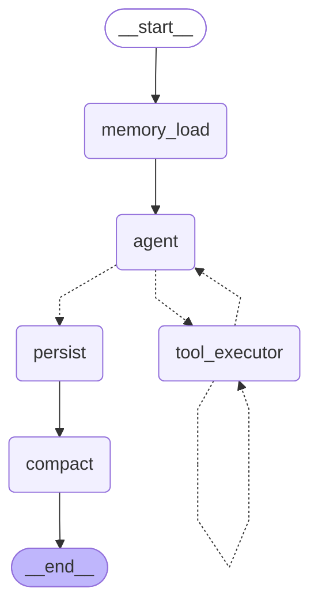

<!-- AUTO-GENERATED — do not edit by hand.
     Regenerate with `make architecture` (or scripts/gen_architecture.py).
     Source of truth is the code; edit the code, then regenerate. -->

# Agent Graph (LangGraph)

Rendered from the compiled `StateGraph` (`app/agent/graph.py:build_graph`) via `get_graph().draw_mermaid()`. The APPROVE-tier interrupt lives inside `tool_executor` (it pauses the graph; resume re-enters the same node).

